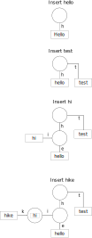

[](https://www.nuget.org/packages/DBTrie)

# DBTrie

This project is a complete rewrite of [DBreeze](https://github.com/hhblaze/DBreeze), which is a managed implementation of a key/value store based on [radix tree](https://en.wikipedia.org/wiki/Radix_tree).

The initial DBreeze project, while working well, is barely maintained and was showing performance issues for my use cases.

This library allows you to have a fine tuned control over the memory cache.

By default, DBTrie does not have any limit over what it keep in memory.
You can use call to `DBEngine.ConfigurePagePool` (described below), to put an upper bound to the memory consumption.

If cache is big enough, the whole database will be in memory, so most query do not result in IO operation.
If there is not enough cache, the least used pages of your database will be removed from the in memory cache.

We worked hard to keep minimum allocations while have a code easy to read.

This database is what you need if all you want is:

* An embedded database.
* Fast Read/Insert with Commit/Rollback capabilities.
* Point queries
* Ordered StartWith queries on the keys.

With a warm cache:
On our machine, enumerating 7000 record with 300 bytes of payload takes 20ms.
A missed point query with a key of 64 bytes is 7 us (1000 us = 1ms) or about 140 000 operation per second.

We have a `DBTrie.Bench` project, so you can test on your own workload.

## How to use

This is a basic key value store.

### How to insert

```csharp
static async Task Main(string args)
{
	Directory.CreateDirectory("Db");
	await using (var engine = await DBTrieEngine.OpenFromFolder("Db"))
	{
		var tx = await engine.OpenTransaction();
		var table = tx.GetTable("MyTable");
		await table.Insert("MyKey", "MyValue");
		await tx.Commit();
	}
}
```

### How to delete

```csharp
static async Task Main(string args)
{
	Directory.CreateDirectory("Db");
	await using (var engine = await DBTrieEngine.OpenFromFolder("Db"))
	{
		// ....
		var table = tx.GetTable("MyTable");
		table.Delete("MyKey");
		tx.Commit();
		// ...
	}
}
```

### How to enumerate

```csharp
static async Task Main(string args)
{
	Directory.CreateDirectory("Db");
	await using (var engine = await DBTrieEngine.OpenFromFolder("Db"))
	{
		// ...
		var table = tx.GetTable("MyTable");
		await foreach (var item in table.Enumerate(startsWith: "Ke"))
		{
			using (item)
			{
				// Do things...
			}
		}
	}
	// ....
}
```

### How to get an item

```csharp
static async Task Main(string args)
{
	Directory.CreateDirectory("Db");
	await using (var engine = await DBTrieEngine.OpenFromFolder("Db"))
	{
		// ....
		var table = tx.GetTable("MyTable");
		using (var row = await table.Get("MyKey"))
		{
			// Do things...
		}
		// ...
	}
}
```

### How to defragment your table

When data is deleted, DBTrie does not immediately free the RAM and storage that was consumed by this data.
For this you need to defragment your tables once in a while.

This operation is iterating over all the saved values, so you should not use it too often and might be quite lengthy.
```csharp
static async Task Main(string args)
{
	Directory.CreateDirectory("Db");
	await using (var engine = await DBTrieEngine.OpenFromFolder("Db"))
	{
		// ....
		var table = tx.GetTable("MyTable");
		await table.Defragment();
		// ...
	}
}
```

### How to limit the memory usage

You can limit the memory usage used by the engine to cache operations:

```csharp
static async Task Main(string args)
{
	Directory.CreateDirectory("Db");
	await using (var engine = await DBTrieEngine.OpenFromFolder("Db"))
	{
		// ....
		// The engine will take at most 4 kb * 1000 = 4MB of memory to cache operations.
		engine.ConfigurePagePool(new PagePool(pageSize: 1024 * 4, maxPageCount: 1000));
		var table = tx.GetTable("MyTable");
		// ...
	}
}
```

You should make sure that the memory used by the number of inserts in one commit does not go bigger than this.

## Best practices

* Use small keys. The bigger the key, the more resource consuming are lookups.
* The API allows the use of `[ReadOnly]Memory<byte>` extensively to limit allocations. If you are writting performance sensitive code, consider using those.
* Think of disposing the `IRow` you get from a table. This decrease the pressure on the garbage collector.
* Think of disposing the `Transaction` you get from the engine.
* Do not create many tables, each table is backed by a file on disk.
* Defragment your table once in a while to decrease RAM and storage consumption.

## Todo

We cache the underlying file of each table in-memory. 
If you limit the memory and no page can be evicted (because all pages have been written to during the on-going transaction), then it will throw an error on insert.

We should one day instead evict written pages on a separate file instead of throwing an error.

## Concept

Radix trees are composed of nodes and values. A node can have an internal value or links to other node or values.
In this example, the word `hi` is stored as an internal value. Each link is annotated by a value which is one byte of the key to be stored.

You can easily understand why having small keys can have a positive impact on performance.



DBTrie is built so that the radix trie is never stored in object form in the memory. Instead pointers are offset into an `IStorage`. (file or cache)
To implement rollback functionality, we place a cache (`CacheStorage`) between the trie and the file (`FileStorage`).
If a rollback is done, written page in the cache are refetched from the file.

A `CacheStorage` works at the page level. If the trie request to read or write memory at some location, the `CacheStorage` will check if the page of this location exists in the cache, and if not, request an empty page from the `PagePool` and fetch the data of the underlying file into the new page.

If the `PagePool` detects that too much page have been asked, it will attempt to evict the least used page from memory and notify the owner of the page (the `CacheStorage`) that this page it granted before is no longer usable.

A `CacheStorage` will make a page impossible to evict if it has been written to but not flushed to the underlying `FileStorage`. If the `PagePool` can't evict any page when it needs, an error `NoMorePageAvailableException` will be thrown during Insert.


## License

MIT